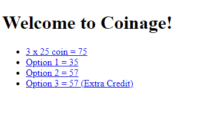

## Functionality

Developing a "coinage" code module that is capable of calculating the total value of coin objects.

### Purpose

- Gain experience writing and executing non-web/web server Node.js JavaScript code using VSCode
- Practice creating and using code modules and refactoring using modern JavaScript syntax
- Gain experience using Fastify with the GET verb, routes, and query parameters

[Function code](https://github.com/Jiah-design/cit281-p3/blob/main/p3-module.js) and [server code](https://github.com/Jiah-design/cit281-p3/blob/main/p3-server.js)

Coinage Webpage

